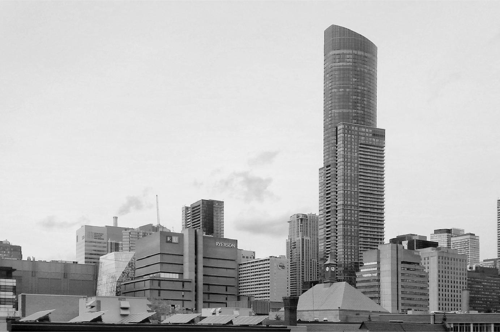
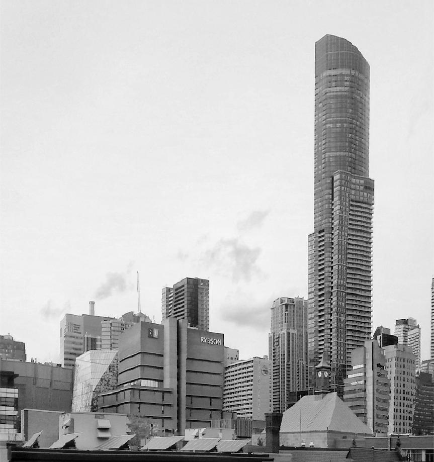
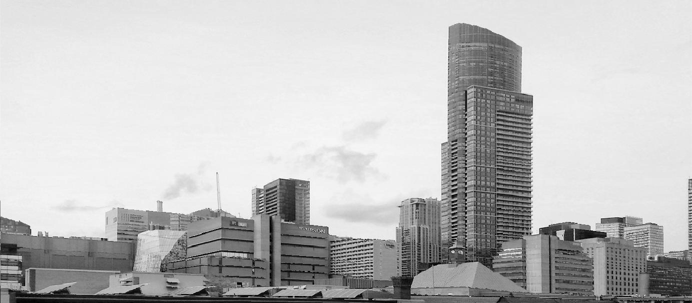
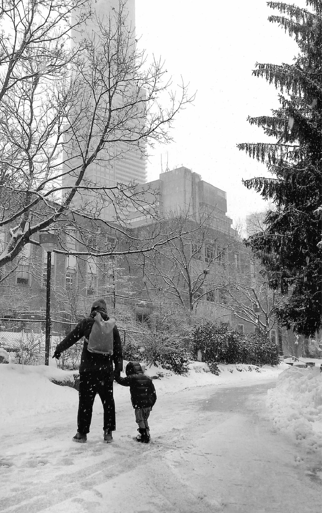
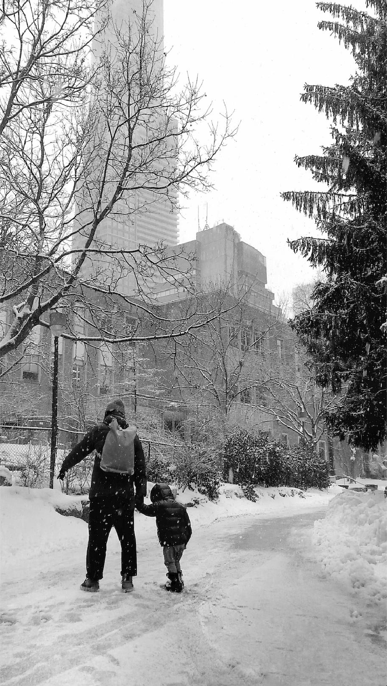
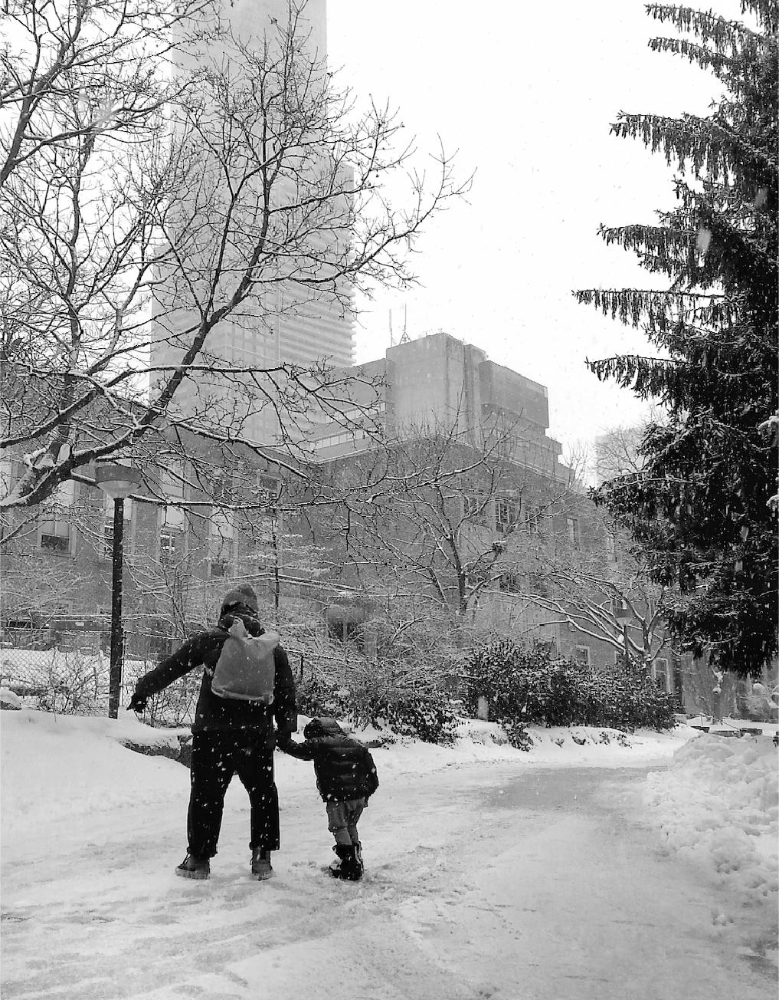
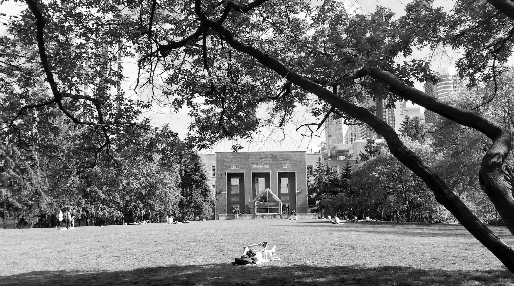
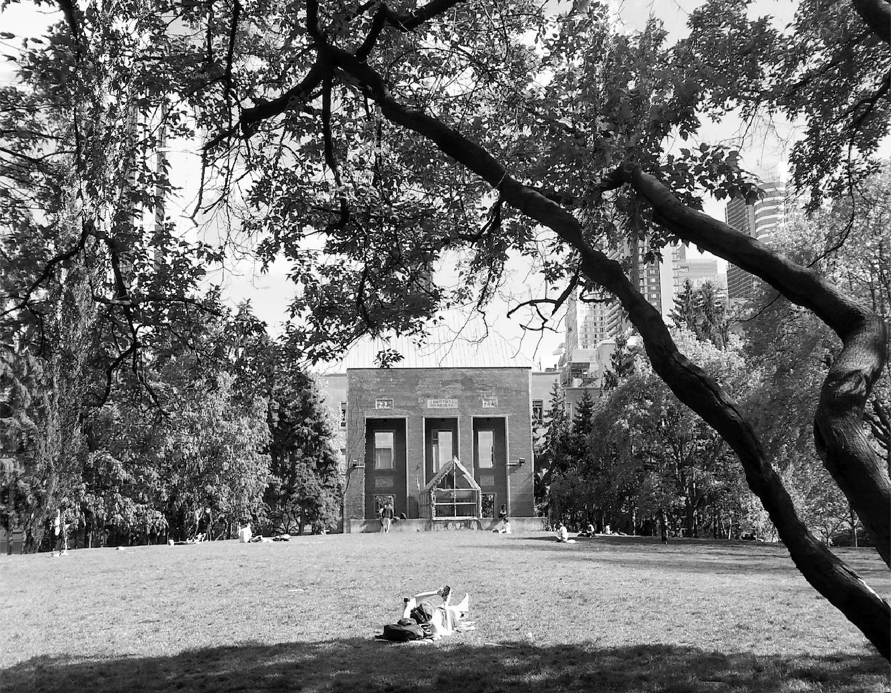
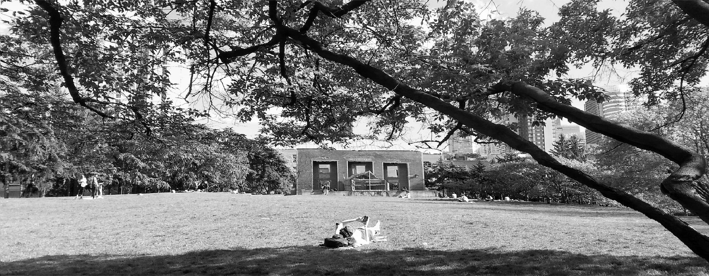

# compVision

### Seam Carving

Seam Carving is the process of reducing image size by removing paths of pixels, ie. 'seams,' while preserving important details of objects within the image.

This concept was first introduced in the 2007 paper *Seam Carving for Content-Aware Image Resizing* which shows how content-aware resizing can be more beneficial than regular cropping techniques. The paper can be read here: [paper link](https://www.researchgate.net/publication/215721610_Seam_Carving_for_Content-Aware_Image_Resizing)

This project implements the Seam Carving algorithm to reduce the size of an image vertically or horizontally. Some examples of images before and after seam carving are shown below.

#### Ryerson Skyline - Original Dimensions 1383×919

|Original Image|Seam Carved Image|Dimensions|
|-------|------|------|
|||Vertical Seam Carved 863×919|
|||Horizontal Seam Carved 1383×606|

#### Walk in the Snow - Original Dimensions 1017×1617

|Original Image|Seam Carved Image|Dimensions|
|-------|------|------|
|||Vertical Seam Carved 913×1617|
|||Horizontal Seam Carved 1017×1304|

#### Sunny Quad - Original Dimensions 1846×1031

|Original Image|Seam Carved Image|Dimensions|
|-------|------|------|
|||Vertical Seam Carved 1325×1031|
|||Horizontal Seam Carved 1846×719|
